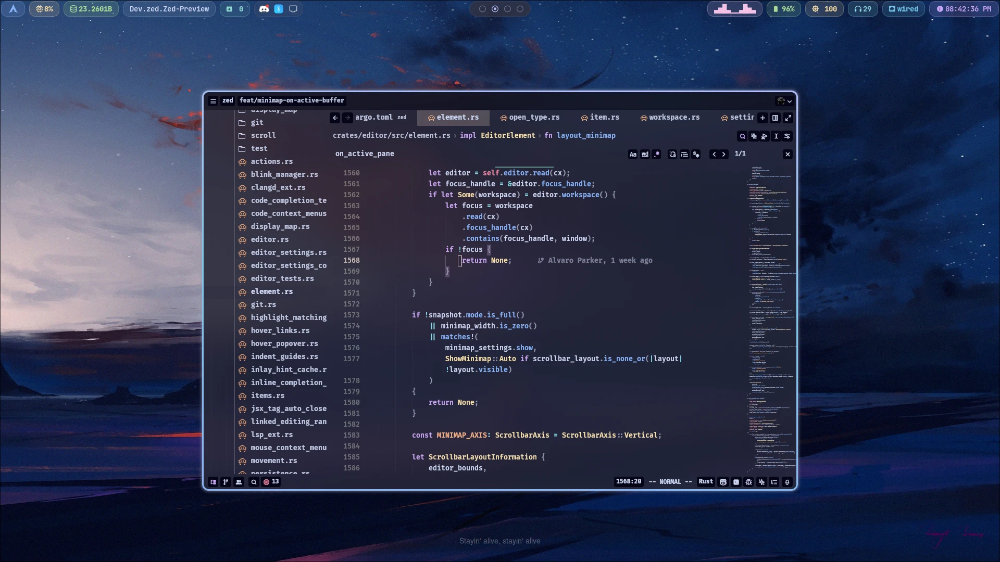
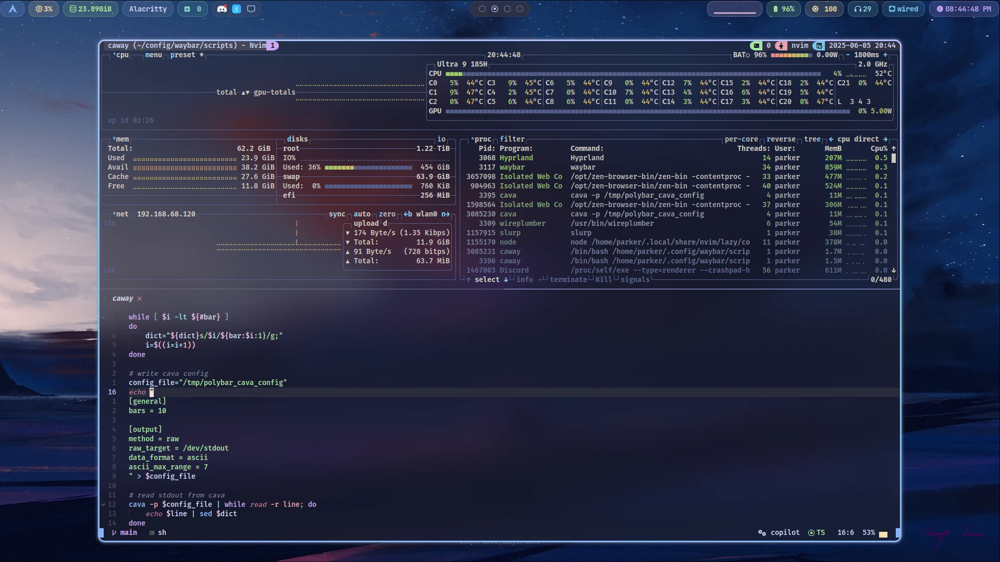
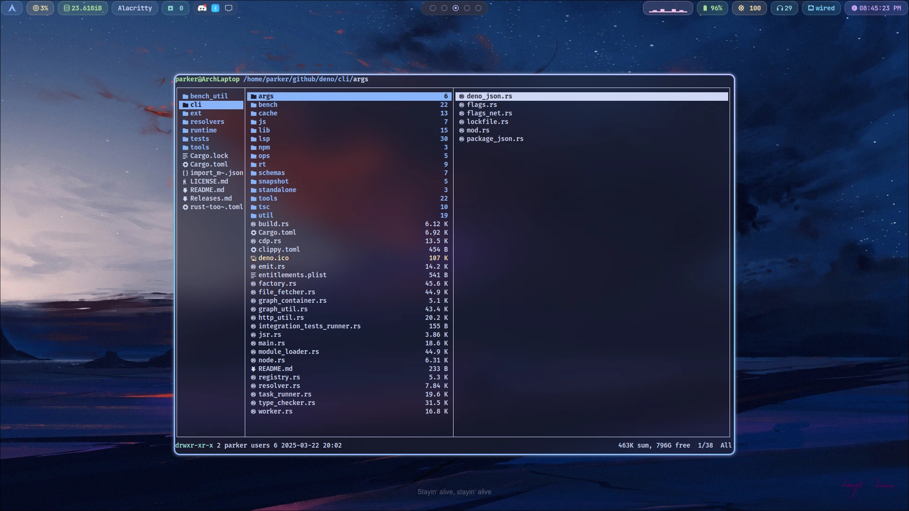
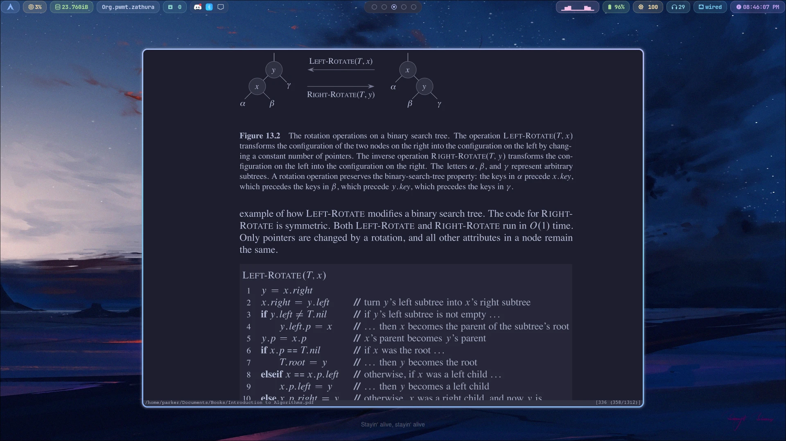

# Arch Linux and Hyprland/i3 dot files

## Warning! The installation script `install` will overwrite your existing dot files! The script has only been tested on a freshly installed Arch Linux with GNOME. Use at your own risk!

## Installation:

It is recommended to first configure your fastest mirrors. You can use `rate-mirrors` AUR package:

```bash
git clone https://aur.archlinux.org/rate-mirrors-bin.git
cd rate-mirrors-bin && makepkg -si
```

Then, on `bash` execute the following command:

```bash
export TMPFILE="$(mktemp)"
sudo true
rate-mirrors --save=$TMPFILE arch --max-delay=43200 && sudo mv /etc/pacman.d/mirrorlist /etc/pacman.d/mirrorlist-backup && sudo mv $TMPFILE /etc/pacman.d/mirrorlist
```

Finally, run the dot files installation script. It will install al the needed dependencies using `paru` to install from the AUR.

```
./install
```

## Utilities

The `genswap` script will generate a new swapfile located at `/swapfile` and will output the needed kernel parameters to add for hibernation. **Do not run if you already have swap configured.**

# Screenshots Hyprland







Programs on the screenshots:

- [`Alacritty`](https://github.com/alacritty/alacritty)
- [`Zed`](https://zed.dev)
- [`Zen`](https://zen-browser.app/)
- [`Fastfetch`](https://github.com/fastfetch-cli/fastfetch)
- `Tmux` - Terminal multiplexer
- `Zathura` - PDF viewer
