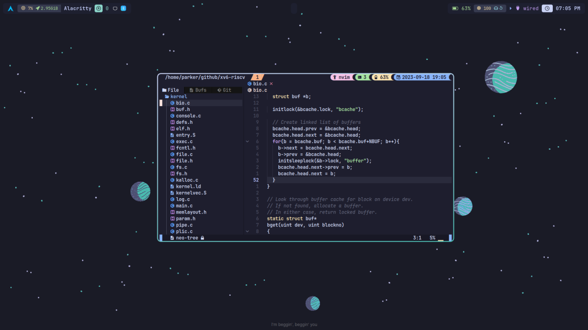
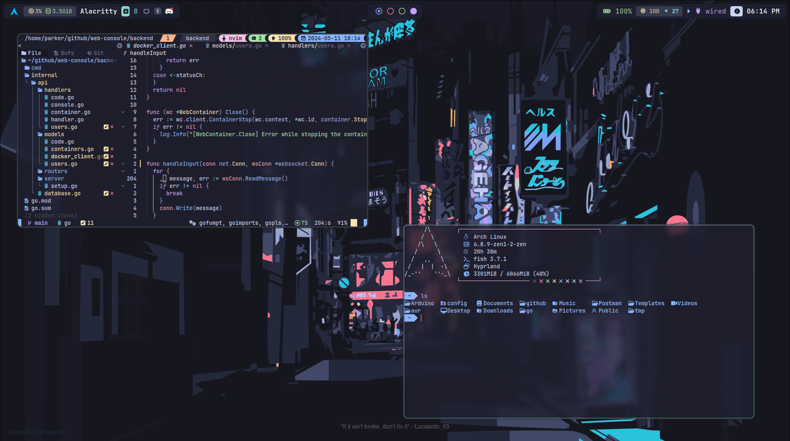

# Arch Linux and Hyprland/i3 dot files
## Warning! The installation script `install` will overwrite your existing dot files! The script has only been tested on a freshly installed Arch Linux with GNOME. Use at your own risk!

## Instalation: 
It is recommended to first configure your fastest mirrors. You can use `rate-mirrors` AUR package:
```bash
git clone https://aur.archlinux.org/rate-mirrors-bin.git
cd rate-mirrors-bin && makepkg -si
```
Then, on `bash` execute the following command:
```bash 
export TMPFILE="$(mktemp)"
sudo true
rate-mirrors --save=$TMPFILE arch --max-delay=43200 && sudo mv /etc/pacman.d/mirrorlist /etc/pacman.d/mirrorlist-backup && sudo mv $TMPFILE /etc/pacman.d/mirrorlist
```
Finally, run the dot files installation script. It will install al the needed dependencies using `paru` to install from the AUR.
```
./install
```

# Screenshots Hyprland


